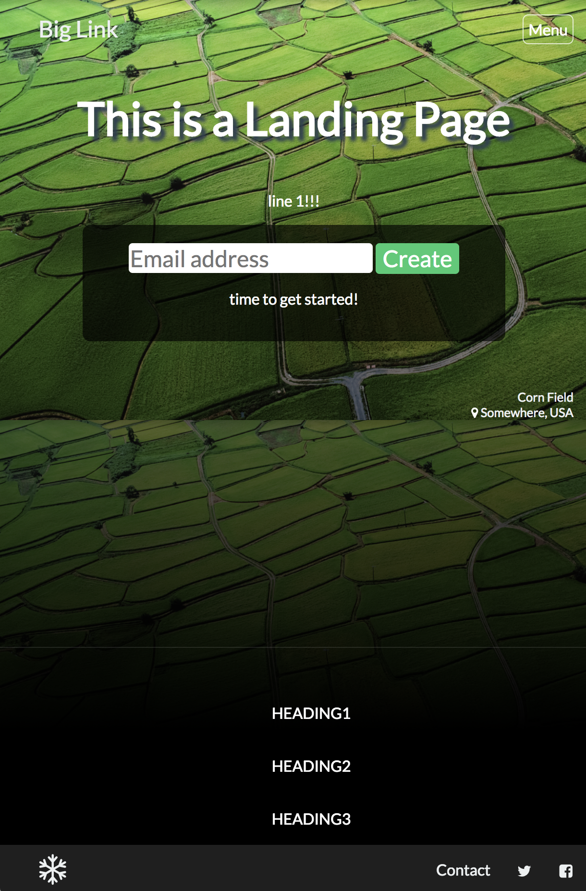
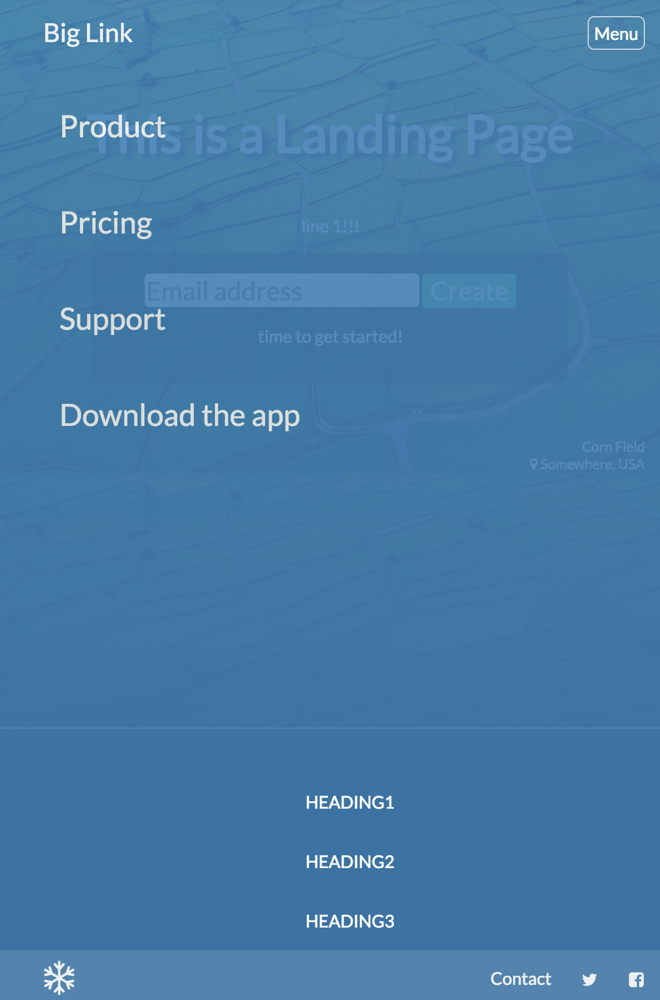
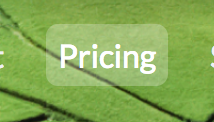

# CS52 Lab 1: Landing Page

Anders Bando-Hess - April 2018

[Link to landing page](drder.me)

I modeled my landing page after the example in the assignment.

I used the checkbox hack and CSS transitions to provide a menu for the mobile version.

Here is what the page looks like after clicking the menu button.

I used hover effects and the border-radius attribute to make my buttons look nicer.

